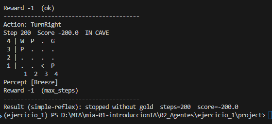
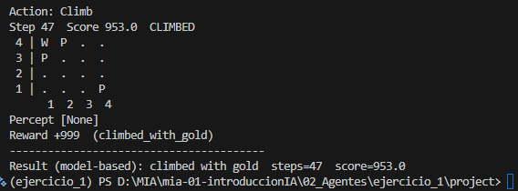
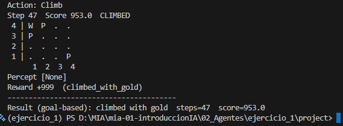
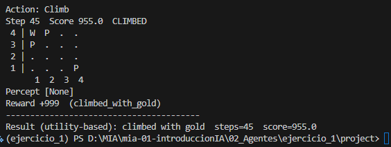
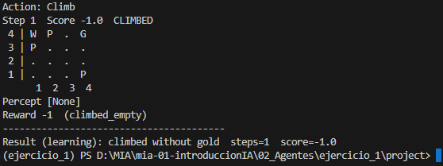
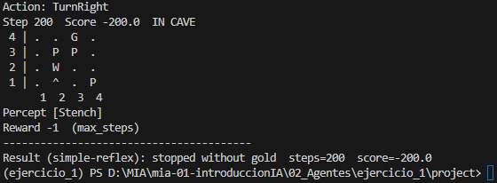
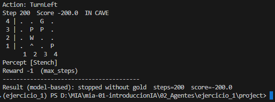
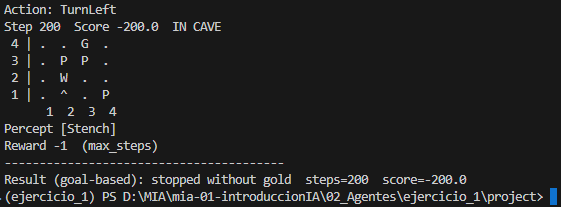
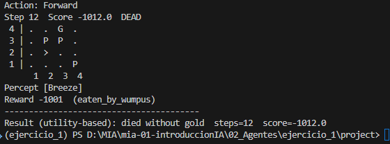
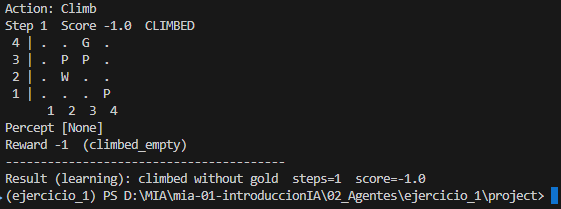

# Agentes - Ejercicio 01
# Objetivo
Crear una nueva configuración modificando la posición del Wumpus y de los pits, respetando las reglas del entorno, y analizar el efecto sobre los distintos agentes.

## Entrega

### 1. El archivo 
Se elaboro el archivo 'config/aae_easy_cueva_4x4.yaml', con una configuración sencilla pensando en que los pozos y el Wumpus genera briza y hedor a su alrededor, lo que dificulta que los agentes lleguen al objetivo.

También, se elaboro el archivo 'config/aae_hard_cueva_4x4.yaml', con una configuración más compleja para que ninguna casilla este libre de briza, hedor, pozo o Wumpus.


### 2. Diagramas de la nueva cueva, indicando agente, Wumpus, pits y oro.

| E | A | S | Y |
| --- | --- | --- | --- |
| W | P | * | G |
| P | * | * | * |
| * | * | * | * |
| A> | * | * | P |


| H | A | R | D |
| --- | --- | --- | --- |
| * | * | G | * |
| * | P | P | * |
| * | W | * | * |
| A> | * | * | P |

### 3. Un breve reporte
   #### 3.1 ¿Qué agentes lograron salir con el oro en tu mapa y cuáles no?
   En el caso de de la cueva EASY, los agentes que pudieron salir con el oro fueron los basados es: modelo, objetivo y utilidad. 

   Sin embargo, en el caso de la cueva HARD, ninguno de los agentes logro salir con el oro. 
   
   #### 3.2 ¿Por qué el **agente de reflejo simple** falla (o tiene suerte) en tu diseño?
   En mi caso, fallo el agente de reflejo simple, porque este tipo de agente necesitaría poder percibir todo el entorno (totalmente observable) para tomar la mejor acción.

   Sin embargo, cuando se ejecuta una acción y se encuentra con una briza o un hedor no puede ver el siguiente estado y su motor de inferencia que obedece a la regla de percepción-acción (*if-then*) que se ajusta a su estado actual, lo que puede ocasionar bucles infinitos .
   
   #### 3.3 ¿Cómo cambia el resultado del **agente basado en modelo** si acercas o alejas un pit de la casilla inicial?
   En la cueva HARD, el agente murio cuando el Wumpu estaba en la casilla (2,2), pero al intercambiar al Wumpu con el pit de la celda (4,1), el agente no puede avanzar y se cicla porque su estado anterior lo percibe como seguro.

### 4.Evidencias (captura de pantalla) de haber corrido los 4 agentes con tus nueva configuración del mundo.

**Ejecución con el archivo: aae_easy_cueva_4x4.yaml**

Comando:
```python
python 02_simple_reflex_agent.py --config config/aae_easy_cueva_4x4.yaml
```

Resultado:




Comando:
```python
python 03_model_based_agent.py  --config config/aae_easy_cueva_4x4.yaml
```

Resultado:




Comando:
```python
python 04_goal_based_agent.py   --config config/aae_easy_cueva_4x4.yaml
```

Resultado:




Comando:
```python
python 05_utility_based_agent.py --config config/aae_easy_cueva_4x4.yaml
```

Resultado:




Comando:
```python
python 06_learning_agent.py --episodes 1500 --config config/aae_easy_cueva_4x4.yaml
```

Resultado:




**Ejecución con el archivo: aae_hard_cueva_4x4.yaml**

Comando:
```python
python 02_simple_reflex_agent.py --config config/aae_hard_cueva_4x4.yaml
```

Resultado:




Comando:
```python
python 03_model_based_agent.py  --config config/aae_hard_cueva_4x4.yaml
```

Resultado:




Comando:
```python
python 04_goal_based_agent.py   --config config/aae_hard_cueva_4x4.yaml
```

Resultado:




Comando:
```python
python 05_utility_based_agent.py --config config/aae_hard_cueva_4x4.yaml
```

Resultado:




Comando:
```python
python 06_learning_agent.py --episodes 1500 --config config/aae_hard_cueva_4x4.yaml
```

Resultado:




