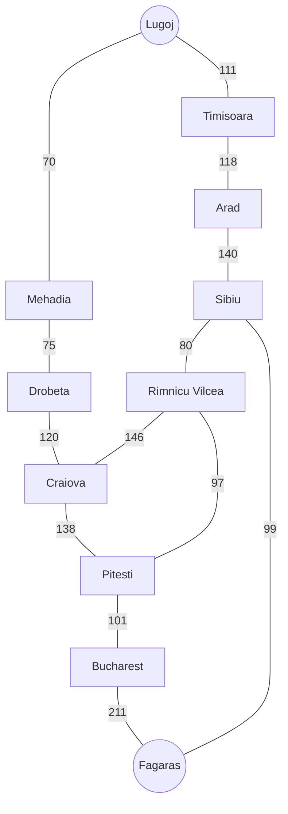
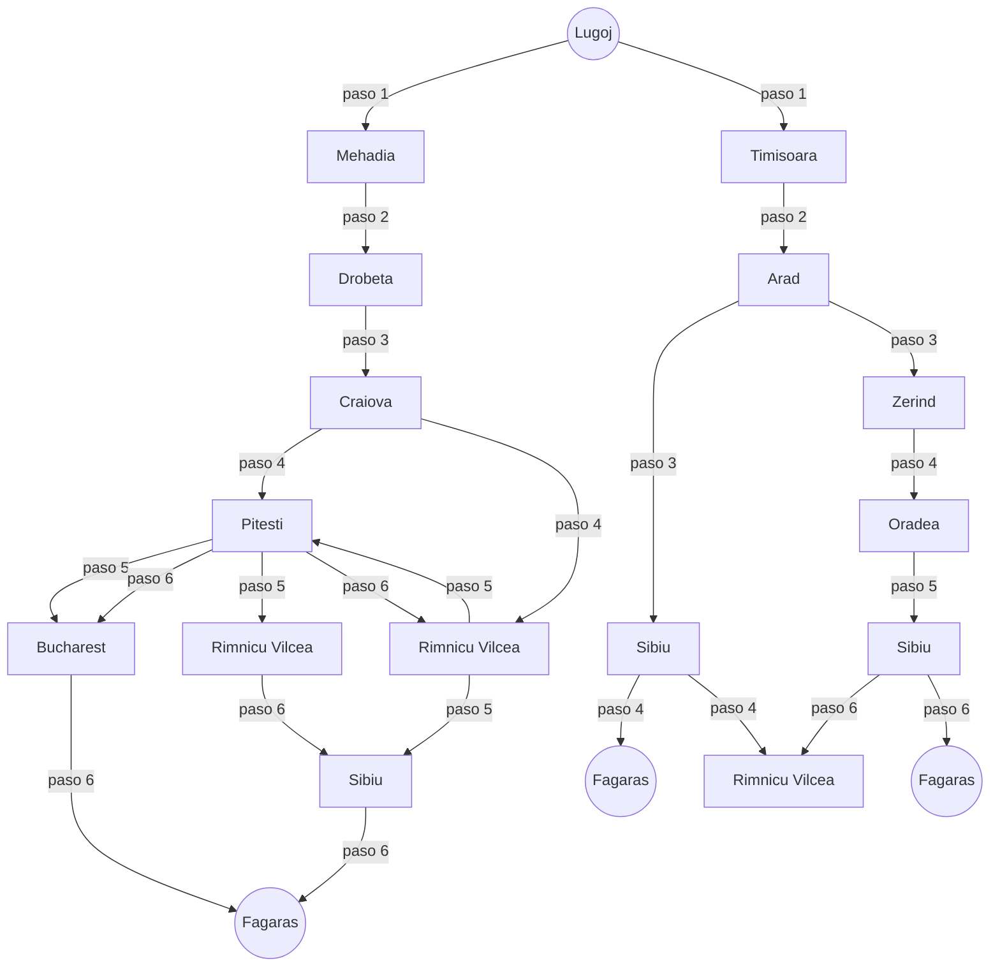
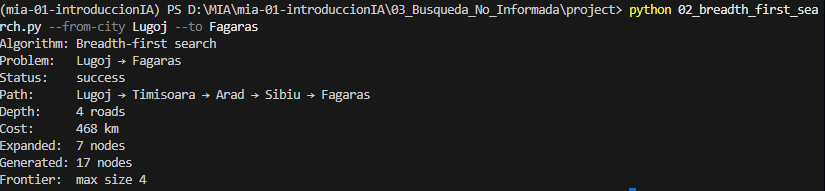
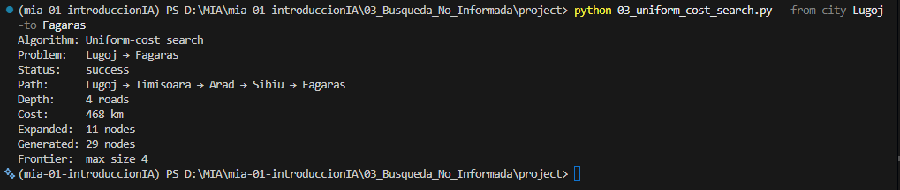
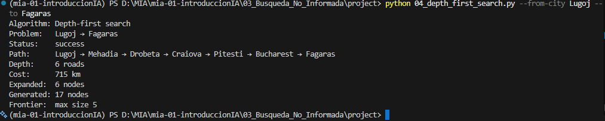
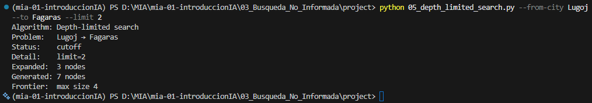
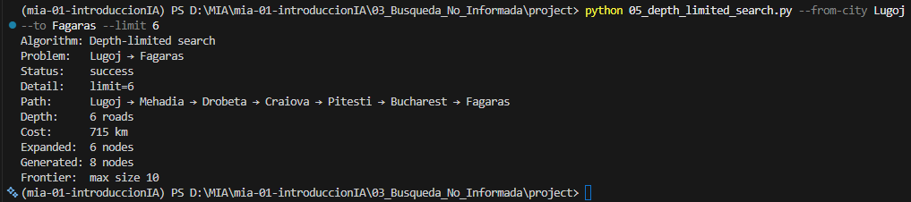
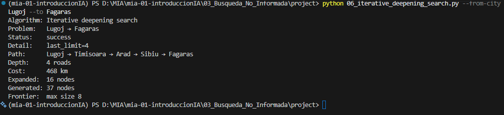

# Ejercicio 1 — Comparar BFS, UCS, DFS, DLS e IDS en el mapa de Rumania

## Contexto

En el proyecto `Búsqueda no informada/project` (AIMA cap. 3, Figura 3.2) se
resuelve el problema de **encontrar una ruta** entre dos ciudades del mapa
carretero de Rumania. Cinco algoritmos de búsqueda **no informada** comparten
el mismo grafo y el mismo `RouteFindingProblem`:

| Programa | Algoritmo | Qué optimiza (o no) |
|---|---|---|
| `02_breadth_first_search.py` | BFS | Menor número de **carreteras** (hops) |
| `03_uniform_cost_search.py` | UCS | Menor costo en **km** |
| `04_depth_first_search.py` | DFS | Ninguna garantía de optimalidad |
| `05_depth_limited_search.py` | DLS | DFS con límite de profundidad |
| `06_iterative_deepening_search.py` | IDS | Misma optimalidad de hops que BFS |

El caso por defecto es **Arad → Bucharest**. En este ejercicio **no vas a
programar** los algoritmos: vas a **elegir otra pareja origen–destino**,
ejecutar los cinco métodos y **explicar** por qué coinciden o discrepan.

Los vecinos se expanden en **orden alfabético**, así que los resultados son
deterministas si usas la misma pareja de ciudades.

## Objetivo

Elegir una ruta distinta de Arad → Bucharest, correr BFS, UCS, DFS, DLS e IDS,
y analizar diferencias de camino, costo, profundidad y nodos expandidos.


## Criterios de aceptación

- La pareja origen–destino **no** es Arad → Bucharest.
- Corriste BFS, UCS, DFS, DLS (con ≥ 2 límites) e IDS sobre esa misma pareja.
- En tu reporte queda claro:
  - si BFS y UCS devolvieron el **mismo** camino o no, y por qué;
  - si IDS coincide con BFS en profundidad (número de carreteras);
  - qué pasó con DLS en el límite bajo (`cutoff`) frente al límite suficiente.
- Incluyes evidencias (capturas o salida de terminal) de las corridas.

- 

## Entrega

### 1. La pareja origen–destino elegida y un diagrama del subgrafo usado.

Se considero la pareja: _Lugoj-Fagaras_



### 2. Una tabla comparativa con Path, Depth, Cost, Expanded (y Status en DLS).

| Algoritmo | Depth | Cost | Expanded | Status | Path |
| --- | --- | --- | --- | --- | --- |
| BFS | 4 roads | 468 km | 7 nodes | Success | Lugoj → Timisoara → Arad → Sibiu → Fagaras |
| UCS | 4 roads | 468 km | 11 nodes | Success | Lugoj → Timisoara → Arad → Sibiu → Fagaras |
| DFS | 6 roads | 715 km | 6 nodes| Success | Lugoj → Mehadia → Drobeta → Craiova → Pitesti → Bucharest → Fagaras |
| DLS (L=2) | -- | -- | 3 nodes | Cutoff | Lugoj → Fagaras |
| DLS (L=6)| 6 roads | 715 km | 6 nodes | Success | Lugoj → Mehadia → Drobeta → Craiova → Pitesti → Bucharest → Fagaras |
| IDS | 4 roads | 468 km | 16 nodes | Success | Lugoj → Timisoara → Arad → Sibiu → Fagaras |


### 3. Un breve reporte (media página) que responda:
   - ¿BFS encontró el camino con **menos carreteras**? ¿UCS el de **menos km**?
     - BFS: encontro el camino con menos carreteras, aunque pudo no ser el más corto, este fue expandiendo su frontera hasta encontrar Fagaras ingresando los nodos a la COLA (FIFO), lo que le llevo a expandir siete nodos antes de encontrar la ciudad objetivo.
     - UCS: también encontro el camino a Fagaras, pero al reordenar la COLA por priodidad, es decir, la de menor costo acumulado, esto hace que el agoritmo vaya haciendo saltos entre los nodos y termine expandiendo más nodos que BFS para este caso.
   - ¿Por qué DFS puede devolver un camino más largo aunque el grafo sea el
     mismo?
     - En el caso se DFS, encuentra el camino hasta Fagaras expandiendo los nodos por orden alfabetico y utilizando la estrategia LIFO. Esto puede ocasionar que, dependiendo del nombre del nodo, el camino más corto puede quedar hasta el fondo de la COLA sin que haya sido explorado, siendo una solución suboptima.
   - ¿Con qué `--limit` DLS pasó de `cutoff` a solución, y cómo se relaciona
     eso con la profundidad del camino de BFS/IDS?
     - DLS con límite igual a 6, alcanzo la ciudad objetivo.
     - En este caso si consideramos que cada nivel de exploración de BFS, corresponde a un paso en profundidad de DLS, se podrá observar su correspondencia, ya que ninguno de los dos considerará a ciudades que esten  a siete pasos.
     - En cuanto a la relación de DLS e IDS, este ultimo va incrementando su límite de maneara iterativa por lo que va a alcanzar el objetivo dentro del límite de 6 saltos, aunque podría encontrarlo antes de eso.


### 4. Evidencias de haber ejecutado los cinco algoritmos.

**Ejecución de los algoritmos**

Comando:
```python
python 02_breadth_first_search.py --from-city Lugoj --to Fagaras
```

Resultado:




Comando:
```python
python 03_uniform_cost_search.py --from-city Lugoj --to Fagaras
```

Resultado:




Comando:
```python
python 04_depth_first_search.py --from-city Lugoj --to Fagaras
```

Resultado:




Comando:
```python
python 05_depth_limited_search.py --from-city Lugoj --to Fagaras --limit 2
```

Resultado:




Comando:
```python
python 05_depth_limited_search.py --from-city Lugoj --to Fagaras --limit 6
```

Resultado:



Comando:
```python
python 06_iterative_deepening_search.py --from-city Lugoj --to Fagaras
```

Resultado:

