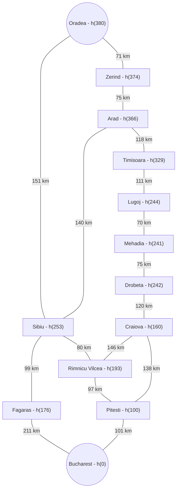
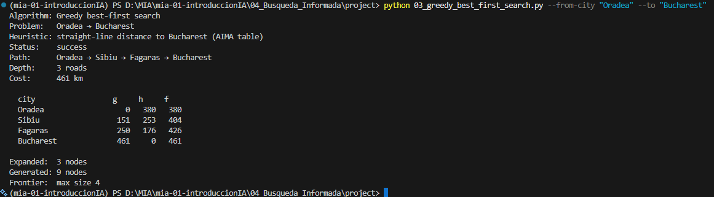
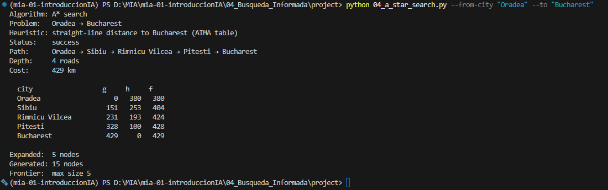
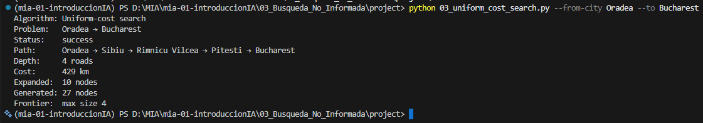
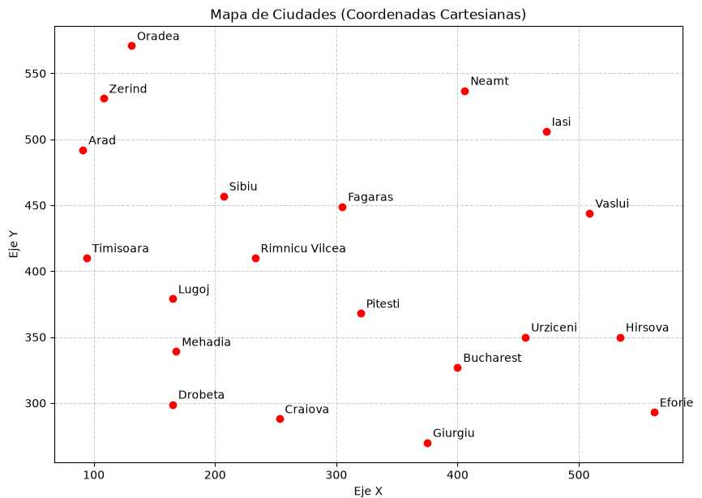

# Ejercicio 1 — Comparar Greedy y A* en el mapa de Rumania

## Contexto

En el proyecto `Búsqueda informada/project` (AIMA cap. 3–4, Figuras 3.2 y 3.22)
se resuelve el problema de **encontrar una ruta** entre dos ciudades del mapa
carretero de Rumania. Dos algoritmos de búsqueda **informada** comparten el
mismo grafo, el mismo `RouteFindingProblem` y la misma heurística `h(n)`:

| Programa | Algoritmo | Qué optimiza (o no) |
|---|---|---|
| `03_greedy_best_first_search.py` | Greedy best-first | Expande el menor `h(n)` (sin garantía de optimalidad) |
| `04_a_star_search.py` | A* | Expande el menor `f(n) = g(n) + h(n)` (óptimo si `h` es admisible) |

El caso por defecto es **Arad → Bucharest**. En este ejercicio **no vas a
programar** los algoritmos: vas a **elegir otra pareja origen–destino**,
ejecutar ambos métodos y **explicar** por qué coinciden o discrepan.

Los vecinos se expanden en **orden alfabético**, así que los resultados son
deterministas si usas la misma pareja de ciudades.

A* (y Greedy) necesitan `h(n)` = estimado desde **cualquier ciudad** hasta el
destino que elegiste. Eso ya está resuelto: no implementas `h`. Al pasar
`--to DESTINO`, `heuristic_for` construye `h(ciudad)` para las 20 ciudades:

- Si el destino es **Bucharest**, usa la **distancia en línea recta** de la
  tabla AIMA (admisible y consistente).
- Si el destino es **cualquier otra ciudad**, usa la **distancia euclidiana**
  entre las coordenadas del mapa (también admisible: nunca sobreestima el
  costo por carretera).

Puedes verificarlo con `python 02_heuristics.py --to DESTINO`: imprime `h`
de cada ciudad hacia ese destino.

## Objetivo

Elegir una ruta distinta de Arad → Bucharest, inspeccionar `h(n)`, correr
Greedy y A*, y analizar diferencias de camino, costo, profundidad y nodos
expandidos a la luz de `g`, `h` y `f`.

## Criterios de aceptación

- La pareja origen–destino **no** es Arad → Bucharest.
- Corriste Greedy y A* sobre esa misma pareja.
- Consultaste `02_heuristics.py` para el mismo destino.
- En tu reporte queda claro:
  - si Greedy y A* devolvieron el **mismo** camino o no, y por qué;
  - qué heurística se usó (tabla AIMA vs. euclidiana);
  - en al menos un punto de decisión, cómo `h(n)` (Greedy) frente a
    `f(n) = g(n) + h(n)` (A*) explica la ciudad que cada algoritmo expandió.
- Incluyes evidencias (capturas o salida de terminal) de las corridas.

## Entrega

### 1. La pareja origen–destino elegida y un diagrama del subgrafo usado (con km y, si cabe, `h` de cada ciudad).

**La pareja seleccionada para este ejercicio es: Oradea-Bucharest**



### 2. Una tabla comparativa con Path, Depth, Cost, Expanded (y la heurística usada).

| Algoritmo | Depth | Cost | Expanded | Heurística | Path |
| --- | --- | --- | --- | --- | --- |
| Greedybest-first | 3 roads | 461 km | 3 nodes | straight-line distance to Bucharest (AIMA table) | Oradea → Sibiu → Fagaras → Bucharest |
| A* | 4 roads | 429 km | 5 nodes | straight-line distance to Bucharest (AIMA table) | Oradea → Sibiu → Rimnicu Vilcea → Pitesti → Bucharest |

### 3. Un breve reporte (media página) que responda:

   - ¿A* encontró el camino de **menos km**? ¿Greedy coincidió o se desvió?
     - A* si encontro el camino con menos km, pero no coincidio con Greedy, porque este último solo considero el camnio que hacia falta por recorrer en cada iteración.
   - ¿Por qué Greedy puede devolver un camino más caro aunque `h` sea admisible?
     - Esto es porque Greedy en cada paso solo evalúa _h(n)_, es decir, solo considera el costo futuro desde el nodo en que se encuetre. Por lo cual la heurística toma gran relevancia para que la discrepancia con el costo real _g(n)_ sea lo más parecido posible.
   - En el camino de A*, ¿`f` tiende a **no disminuir** a lo largo de la ruta? Relaciónalo con que `h` sea consistente (en particular si el destino es Bucharest y se usa la tabla AIMA).
     - Sí, _f(n)_ tiende a aumentar en cada iteración porque evalúa tanto el pasado real _g(n)_ y el futuro estimado _h(n)_. Que _h(n)_ sea consistente quiere decir que esta nunca sobreestima el costo real, esto quiere decir que _h(n)_ ≤ _f(n)_.

### 4. Evidencias de haber ejecutado Greedy, A* y el listado de heurísticas.

**Ejecución de los algoritmos**

Comando:
```python
python 03_greedy_best_first_search.py --from-city "Oradea" --to "Bucharest"
```

Resultado:



Comando:
```python
python 04_a_star_search.py --from-city "Oradea" --to "Bucharest"
```

Resultado:




## Reto opcional

- Elige una pareja en la que Greedy y A* **discrepen** claramente (Greedy
  “se acerca” en línea recta pero paga más km). Compara además el número de
  nodos expandidos: ¿cuál algoritmo “trabajó” más en tu instancia?
  - Para el caso Oradea - Bucharest, se puede observar que Greedy paga más km porque al expandir los nodos vecinos de Sibio solo toma en cuenta a Fagras que tiene un costo estimado de 176 km y descarta la opción de Rimnicu Vilcea, que al final tiene un costo real menor.
- Corre la **misma** pareja con UCS en
  `Búsqueda no informada/project` (`03_uniform_cost_search.py`). Si `h` es
  admisible, el costo de A* debería coincidir con el de UCS; Greedy no
  tiene por qué.
  Es correcto, el costo de A* coincide con el de UCS. Sí _h(n)_ no admisible entonces podría llevar a A* por un camino incorrecto.

Comando:
```python
python 03_uniform_cost_search.py --from-city Oradea --to Bucharest
```

Resultado:



- Cambia solo el destino (mismo origen): una vez a Bucharest y otra a una
  ciudad distinta. Observa cómo cambia la etiqueta de la heurística y si
  Greedy sigue (o deja de) coincidir con A*.

**Para la pareja Oradea-Lugoj**
Si cambia el destino también cambia el comportamiento de los algoritmos.

| Algoritmo | Depth | Cost | Expanded | Heurística | Path |
| --- | --- | --- | --- | --- | --- |
| Greedybest-first | 6 roads | 642 km | 6 nodes | Euclidean distance to Lugoj (map coordinates) | Oradea → Sibiu → Rimnicu Vilcea → Craiova → Drobeta → Mehadia → Lugoj |
| A* | 4 roads | 375 km | 6 nodes | Euclidean distance to Lugoj (map coordinates) | Oradea → Zerind → Arad → Timisoara → Lugoj |

**Se puede considerar el cada ciudad como un punto en un plano cartesiano**

