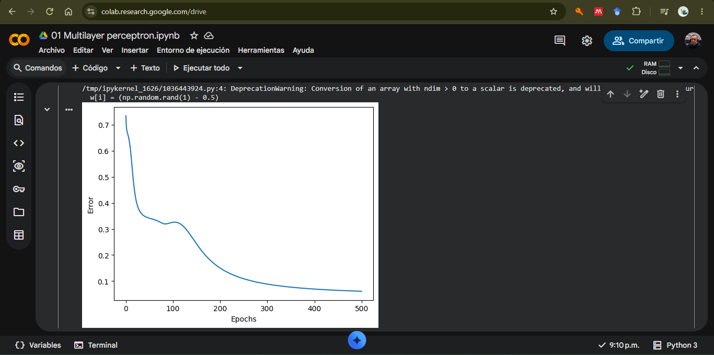
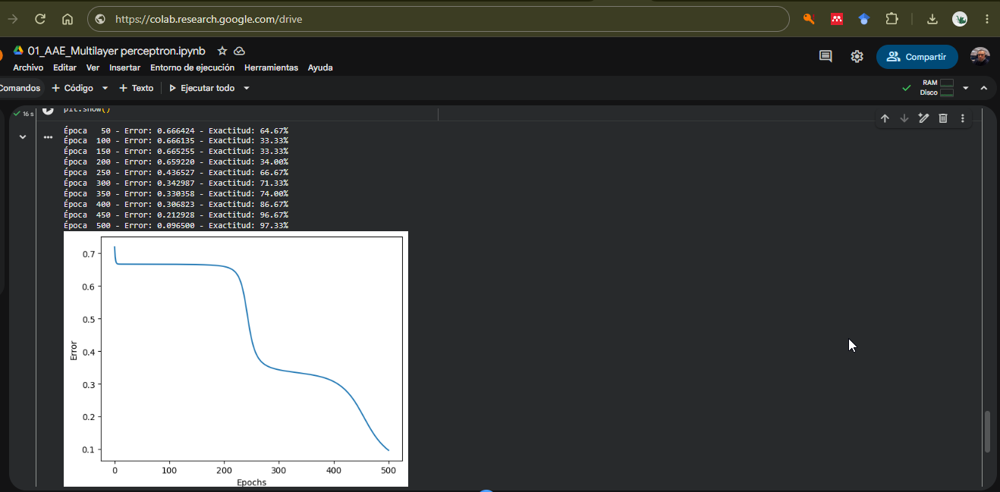
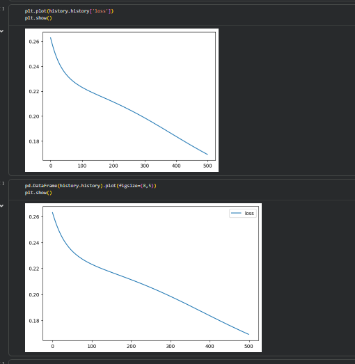
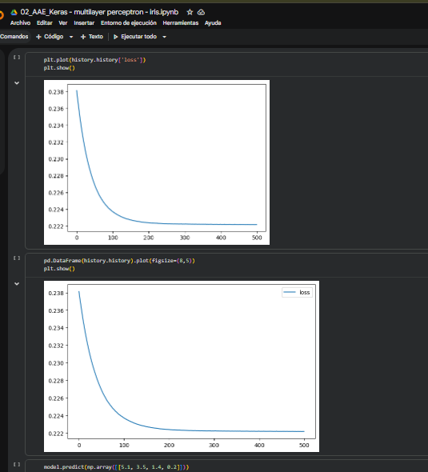
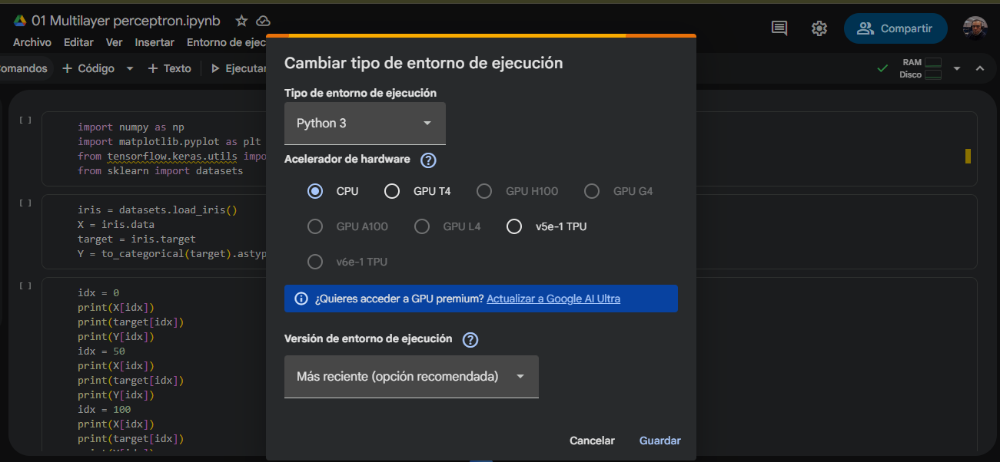

# Ejercicio 1 — Más capas en el perceptrón multicapa (Iris)

## Contexto

En `Perceptrón multicapa/Notebooks/` hay dos notebooks que resuelven el mismo
problema: clasificar las **3 especies** del conjunto **Iris** (4 atributos:
sépalo/pétalo en largo y ancho). Ambas redes son un MLP con activación
**sigmoide**, error **MSE**, **SGD** con \(\eta = 0.03\) y **500 épocas**.

| Notebook | Cómo está implementada | Topología inicial |
|---|---|---|
| `01 Multilayer perceptron.ipynb` | A mano (NumPy): forward, error y backprop | \(4 \times 3 \times 3\) |
| `02 Keras - multilayer perceptron - iris.ipynb` | Keras / TensorFlow (`Sequential`) | \(4 \times 3 \times 3\) |

En la notebook 01, \(4 \times 3 \times 3\) significa: **4** entradas, **una**
capa oculta de **3** neuronas y **3** neuronas de salida (una por clase). En
Keras es lo mismo: dos `Dense(3)` (la primera con `input_shape=(4,)`).

En este ejercicio **sí vas a modificar código**, pero no el de
`Perceptrón multicapa/project/`. Trabajas **en Colab**, sobre **copias** de las
dos notebooks.

## Objetivo

Correr ambas notebooks en **Google Colab** con la arquitectura original,
**agregar dos capas** a cada red, volver a entrenar y **comparar** qué cambia
(curva de error/pérdida, velocidad, calidad de la clasificación).

## Criterios de aceptación

- Las dos notebooks originales corrieron en **Colab** (no solo en tu máquina).
- Cada red profunda tiene **dos capas extra**; la salida sigue siendo de
  **3** neuronas.
- La notebook 01 actualiza forward **y** backprop (no solo la inicialización).
- Hay evidencias (capturas) de las **cuatro** corridas: curvas y, en Keras,
  `model.summary()` original y profundo.
- El reporte compara implementación a mano vs. Keras **y** red original vs.
  red más profunda; no es un resumen de lo que “debería” pasar sin números.

## Entrega

1. Enlaces de Colab (o archivos `.ipynb`) de las dos notebooks **modificadas**,
   con las corridas originales y las profundas.
  - Enlaces a los Notebook originales: https://github.com/andreximo/mia-introduccionIA/tree/main/05_Perceptr%C3%B3n_Multicapa/Notebooks_Originales
  - Enlaces a los Notebook con las corridas profundas.
2. Capturas: curvas de error/pérdida de las cuatro corridas y los dos
   `model.summary()` de Keras.
  - **Perceptron Multicapa**
    - _Original_
      

    - _Profundo_
      

  - **Perceptron Multicapa con Keras**
    - _Original_
      

    - _Profundo_
      

3. Un breve reporte (media página a una página) que responda:
   - ¿Bajar más el error al añadir dos capas, o se estancó / empeoró? ¿Igual
     en NumPy y en Keras?
     En el caso del Perceptron Multicapa con NunPy, se observa que si bajo más el error al agregar dos capas más contra el original.
     En cuanto a las Notebook con Keras, cuando se agregaron las dos capas a la red, se observa que empeoro el error y alcanzó su máximo desenso al rededor de la epoca 105.
   - ¿Las curvas de la notebook 01 y de Keras se parecen con la misma
     topología? Si no, ¿qué diferencias de implementación podrían explicarlo
     (orden de los datos, inicialización, vectorización, etc.)?
     Las curvas de las Notebook implementada con Numpy y las implementadas con Keras, no parecen terner la misma totpología en las primeras parece que se detiene y luego comienzan a descender, mietras que las que están con Keras parecen más uniformes como si fueran una función logarítmica.
     Dentro de las pruebas que realice para el data set de Iris, pude observar que cambian cuando normalice los datos, también observe que cambia si se actualizan todas las deltas y después se actualizan los pesos de la red. 
   - Con sigmoides apiladas y MSE, ¿tiene sentido que una red **más profunda**
     no aprenda mejor en Iris? Relaciónalo con lo que viste en las gráficas.
     Si tiene sentido, ya que eso de debe al desvanecimiento de gradiente. Durante la retropropagación entre más capas tenga la red el error que actualiza los pesos será cada vez más pequeño, para el caso de nuestra red con 4 capas y la función sigmoide, el valor de la actualización de los pesos estaría en el orden de 0.0039.

4. Evidencias de haber ejecutado en Colab (captura del entorno Colab o del
   menú Runtime).
  - **Perceptron Multicapa**
      - _Original_
      

      - _Profundo_
      

  - **Perceptron Multicapa con Keras**
      - _Original_
      

      - _Profundo_
      
