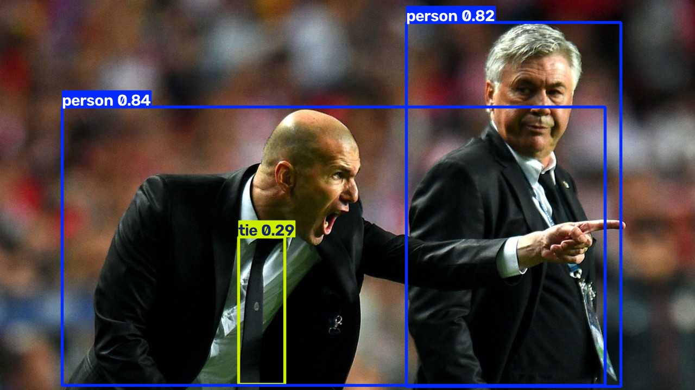
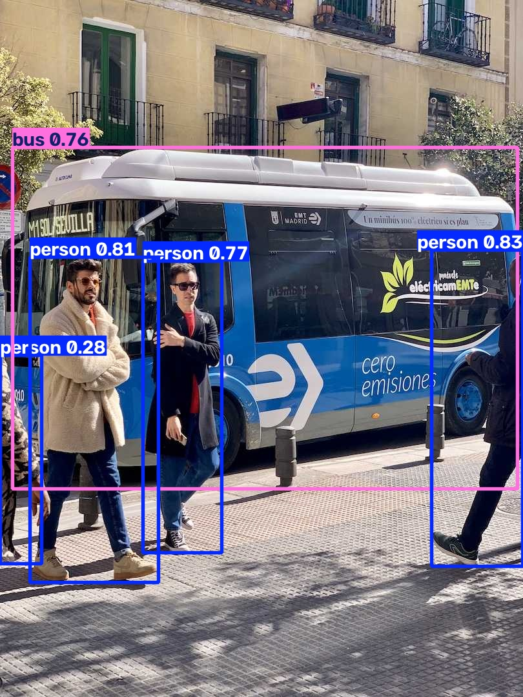
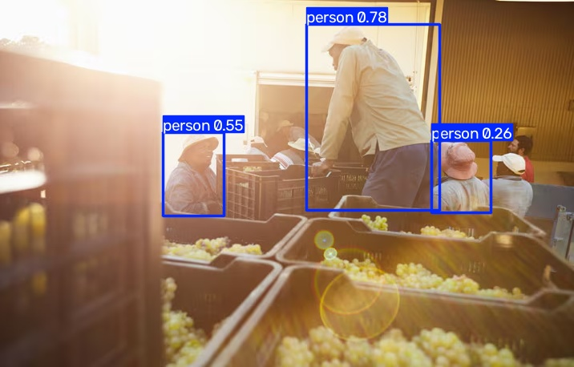
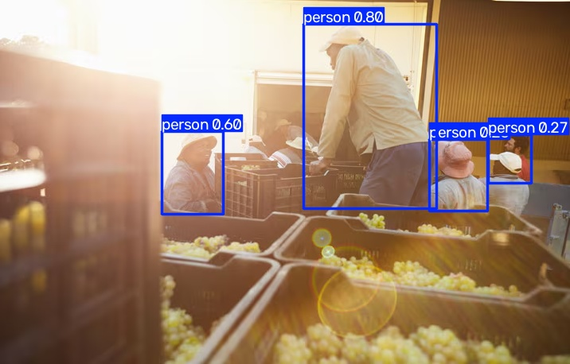
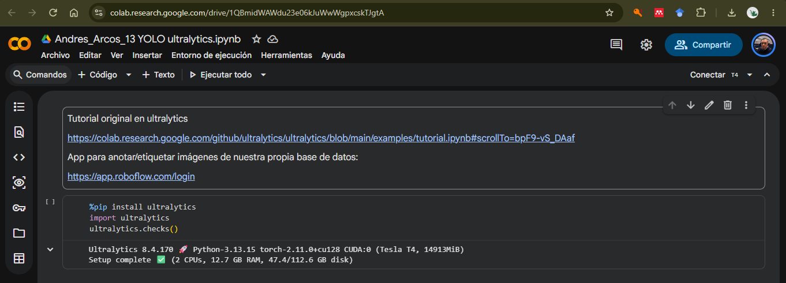

# Ejercicio 1 — Cambiar la imagen de predicción en YOLO

## Contexto

La notebook `Visión computacional/Notebooks/13 YOLO ultralytics.ipynb` es un
tutorial corto de **YOLOv8** (paquete Ultralytics) pensado para **Google
Colab**. Hace tres cosas:

1. Instala `ultralytics` y comprueba el entorno.
2. Corre inferencia por CLI sobre la foto de muestra `zidane.jpg`.
3. Carga `yolov8n.pt`, entrena **3 épocas** en `coco128` y predice
   `bus.jpg`.

YOLO detecta objetos de las clases **COCO** (persona, auto, bus, corbata,
etc.) y dibuja cajas. En este ejercicio **sí vas a modificar código**, pero
solo un cambio pequeño y visible: **la imagen sobre la que predice**.

No toques `Visión computacional/project/`. Trabajas en **Colab**, sobre una
**copia** de la notebook.

## Objetivo

Correr la notebook en Colab **tal como está**, sustituir las dos imágenes de
muestra por **una imagen tuya** (la misma en ambas predicciones) y comparar
qué objetos detecta YOLO en la foto original frente a la tuya.

## Criterios de aceptación

- La notebook original corrió en **Colab** (no solo en tu máquina).
- El único cambio de código es la **fuente de la imagen** en las dos
  predicciones; el modelo sigue siendo `yolov8n.pt`.
- Tu imagen no es `zidane.jpg` ni `bus.jpg`.
- Hay capturas de las predicciones **originales** y de la **tuya**, con
  cajas visibles.
- El reporte nombra clases concretas (no basta “detectó cosas”).

## Entrega

1. Enlace de Colab (o el `.ipynb` modificado) con la corrida original y la
   predicción sobre tu imagen.

   - [Notebook](https://colab.research.google.com/drive/1QBmidWAWdu23e06kJuWwWgpxcskTJgtA)

2. Capturas: salida sobre `zidane.jpg`, sobre `bus.jpg` y sobre **tu**
   foto.
    - **Zidane**
     

    - **Bus**
     

    - **Agricultores (MODEL)**
     

    - **Agricultores (CLI)**
     

3. Un breve reporte (media página) que responda:
   - ¿Qué clases detectó YOLO en las fotos de Ultralytics y cuáles en la
     tuya?
     En las fotos de Ultralytics se etiquetaron a personas, buses y una corbata.
     En mi foto solo se etiqueto a personas.
   - ¿Algún objeto evidente de tu foto **no** salió etiquetado? ¿Por qué
     podría pasar (clase que no está en COCO, objeto chico, recorte,
     umbral de confianza)?
     En mi imagen se obsevan algunos agricultores que están cargando un camión con cajas de uvas y la foto fue tomada a contra luz del sol.
     La mayoria de objetos que se aparecen en la foto, no están dentro de las clases que COCO detecta, sin embargo, hay que personas que no fueron detectadas por el umbral de confianza, aunqque pudo detectar a la mayoria.
   - ¿La predicción de la celda CLI y la de `model(...)` coinciden sobre
     tu misma imagen?
     No coinciden, CLI detecto a más personas que MODEL, esto puede deberse a 
4. Evidencia de haber ejecutado en Colab (captura del entorno o del menú
   Runtime, idealmente con GPU).
    - **Entorno de ejecución**
     