# Ejercicio 1 — Separar los blobs y volver a elegir \(k\)

## Contexto

La notebook `Clustering K-medias/Notebooks/01 K-medias.ipynb` (capítulo de
Géron / Hands-On ML) entrena **k-means** de scikit-learn sobre nubes
gaussianas y termina con segmentación de color de una foto.

La parte central genera **5** blobs, ajusta `KMeans(n_clusters=5, ...)` y
después busca el \(k\) “bueno” con dos herramientas:

| Herramienta | Qué grafica | Lectura en la notebook original |
|---|---|---|
| **Codo** (inercia \(J\) vs \(k\)) | `inertias` para \(k = 1,\ldots,9\) | El codo está en **\(k = 4\)**, no en 5 |
| **Silueta** | `silhouette_score` para \(k = 2,\ldots,9\) | \(k = 4\) se ve muy bien; **\(k = 5\)** también |

Eso no es un bug: tres blobs de la izquierda están **casi pegados**
(`std = 0.1` y centros en \(x = -2.8\)). K-means (y el codo) los trata como
un solo grupo.

En este ejercicio **sí vas a modificar código**, pero un cambio pequeño y
local: **alejar esos blobs**. No toques `Clustering K-medias/project/`.
Trabajas en **Colab**, sobre una **copia** de la notebook.

## Objetivo

Correr la notebook en Colab **tal como está**, anotar el \(k\) que sugieren
codo y silueta, **separar los 5 blobs** en el arreglo `blob_centers` (y, si
hace falta, `blob_std`) y volver a graficar. Debes ver si el codo y la
silueta se mueven hacia **\(k = 5\)**.

## Criterios de aceptación

- La notebook original corrió en **Colab** (no solo en tu máquina).
- Los centros **no** son los de Géron; en el scatter se distinguen
  **cinco** nubes (aunque alguna se solape un poco).
- Sigues teniendo **5** centros y 2000 puntos.
- Hay capturas **antes y después** del scatter, del codo y de la silueta.
- El reporte dice con números (inercias o scores) si el codo / la silueta
  se acercaron a \(k = 5\); no basta “se ve mejor”.

## Entrega

1. Enlace de Colab (o el `.ipynb` modificado) con la corrida original y
   la de blobs separados.
**Colab**
```
    https://colab.research.google.com/drive/1j6wNGCBB9peMN3gQ-XmTBRwSYRglbf-D
```

2. Capturas: scatter, Voronoi \(k = 5\), codo y silueta — **original** y
   **modificado** (8 figuras, o 4 pares).

    | - | Original | Modificado |
    | --- | --- | --- |
    | Scatter | 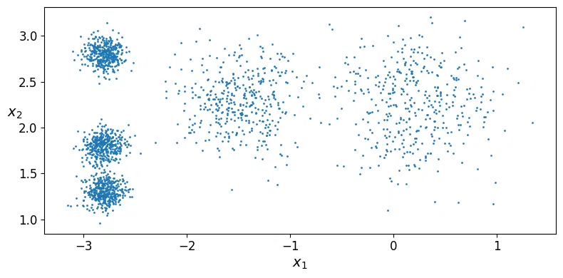 | 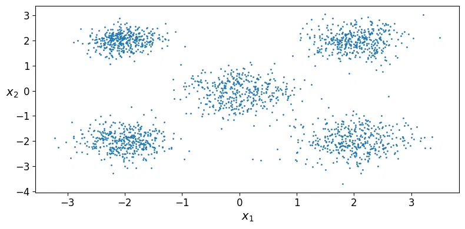 |
    | Voronoi | 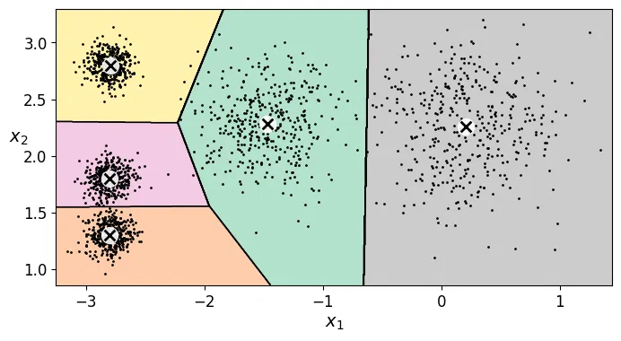 | 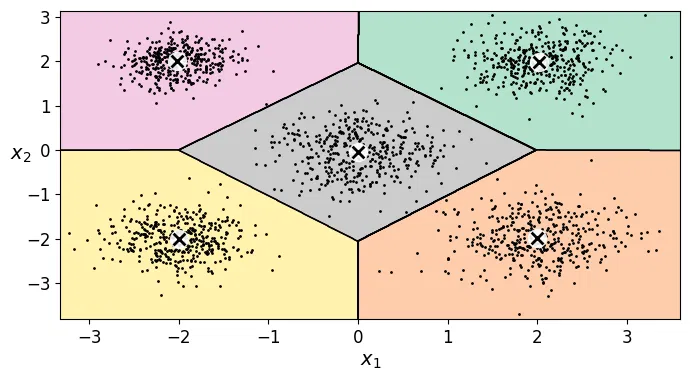 |
    | Codo | 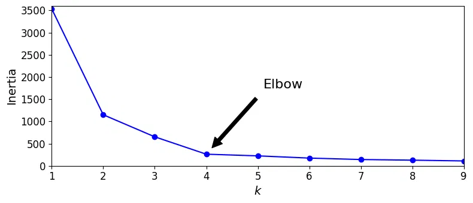 | 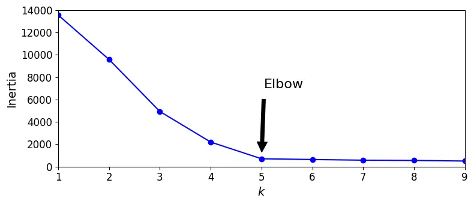 |
    | Silueta | 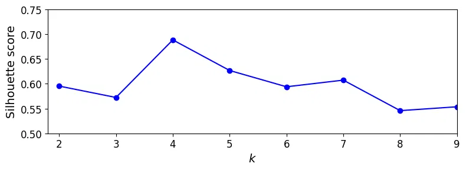 | 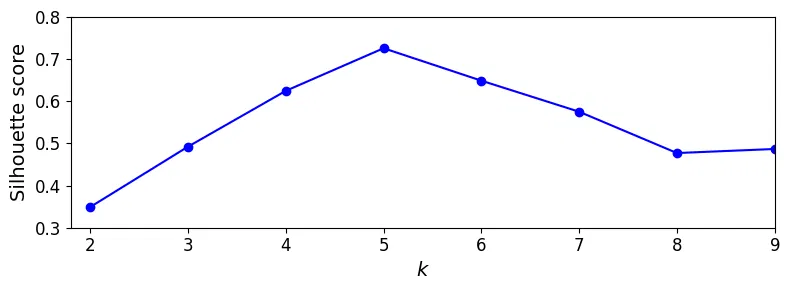 |

3. Los 5 centros y 5 `std` que usaste.

    | Grupo | Centro(x,y) | std |
    |---|---|---|
    | 1 | [0.0,  0.0] | 0.5 |
    | 2 | [ 2.0,  2.0] | 0.4 |
    | 3 | [-2.0,  2.0] | 0.3 |
    | 4 | [-2.0, -2.0] | 0.4 |
    | 5 | [ 2.0, -2.0] | 0.5 |

4. Un breve reporte (media página) que responda:
   - En los datos de Géron, ¿por qué el codo “prefiere” \(k = 4\) si `make_blobs` usó 5 centros?
        
    Como se puede observar en la imagen de abajo, la diferencia entre la inercia del codo 4 y el codo 5 es de 37.7, lo que representa una tasa de reducción del 14.4%; mientras que la tasa de reducción entre el codo 3 y el codo 4 fue del 59.9%. Esto quiere decir que si se dejan 4 codos aumenta muy poco la inercia, ya que sus datos están compactos.
    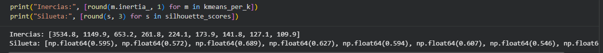

   - Con tus blobs separados, ¿el codo y la silueta coinciden en el mismo
     \(k\)? ¿Ese \(k\) es 5?
     
     En el caso propuesto, ambos coinciden. Y como se puede ver en la imagen de abajo, la diferencia  entre el codo 4 y codo 5 es de 1496.1; la diferncia de inercia entre el codo 5 y codo 6 es de 65.1.
     En el caso de Siluette, alcanza su valor máximo en el cluster 5 con un valor de 0.726 y en los cluster siguentes comienza a decrecer ese valor.
        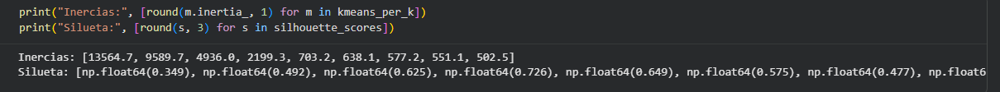

   - Si el codo sigue en 4, ¿qué te falta mover (distancia entre centros
     vs. `blob_std`)?
     
     Para el caso de los atos de Géron, habría que mover la distancia entre los centros de esa manera, la diferencia entre la inercia del codo 4 y 5 aumentaria.
     En caso que yo planteé, no fue necesario mover más los centros.

5. Evidencia de haber ejecutado en Colab (captura del entorno o del menú
   Runtime).
    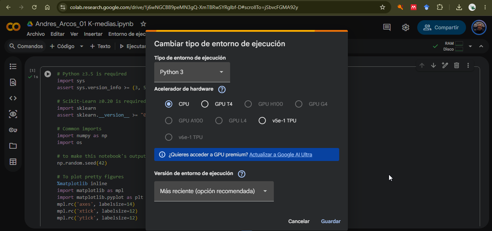