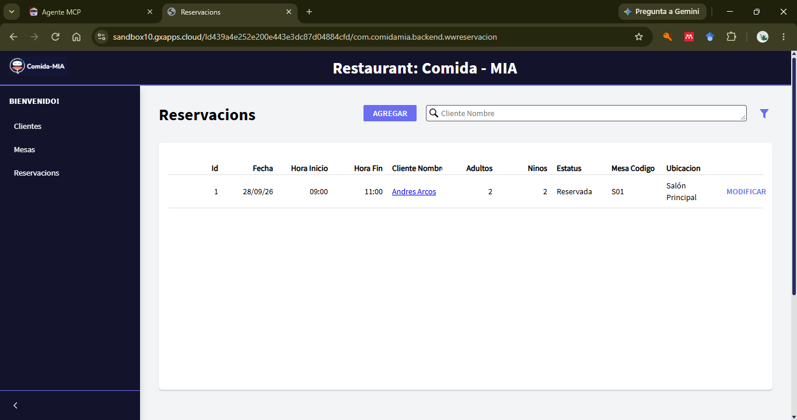
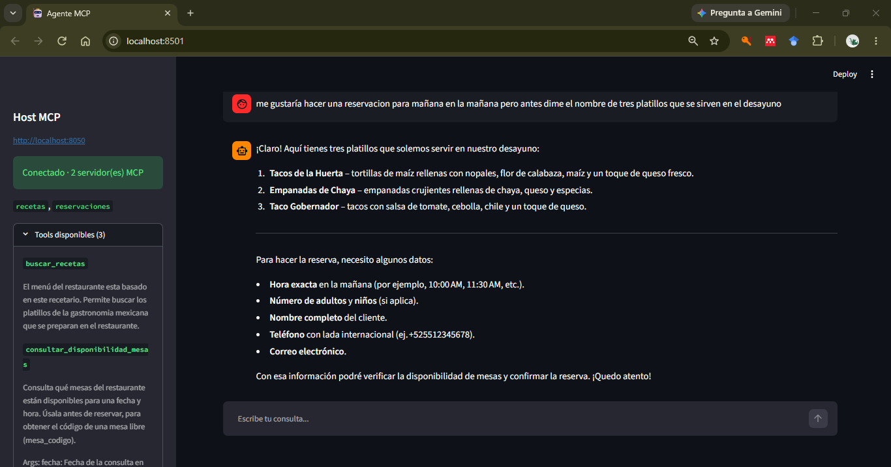
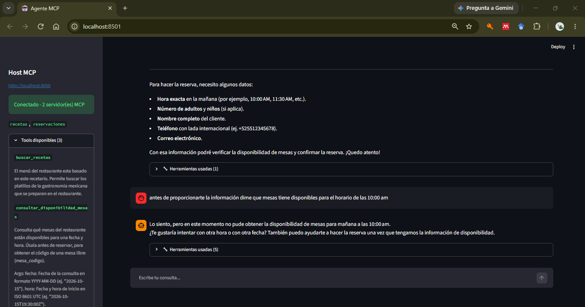
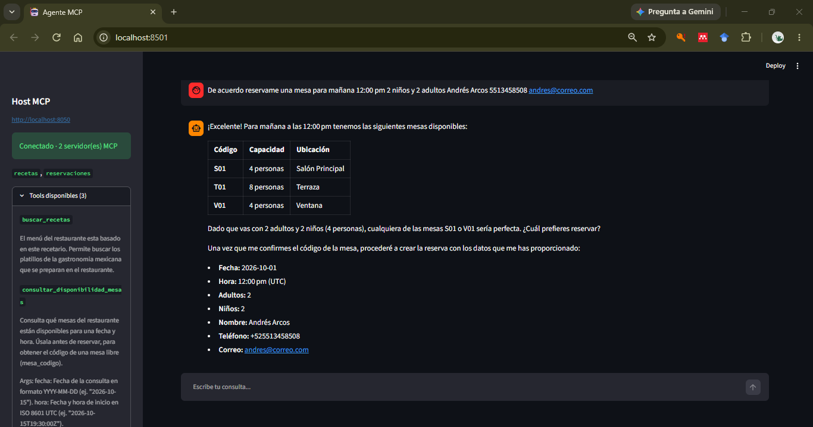
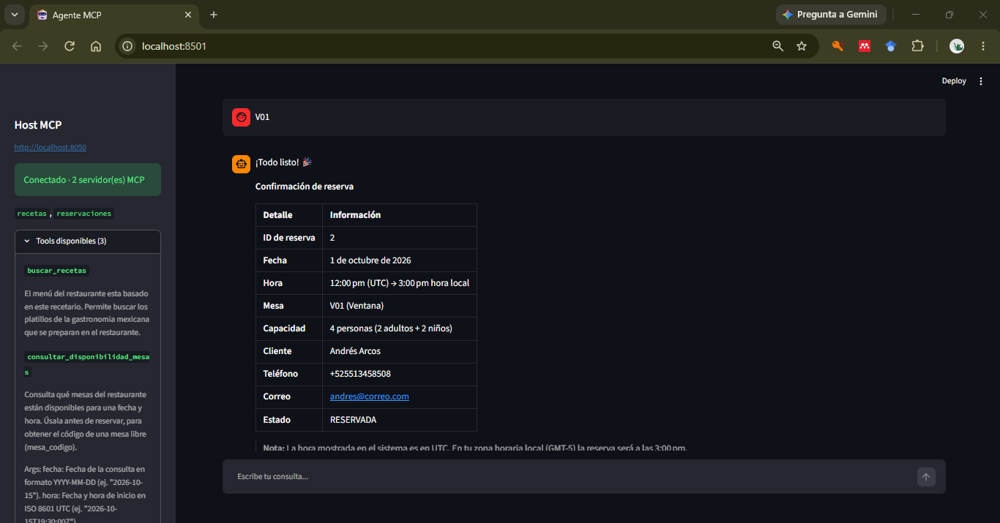
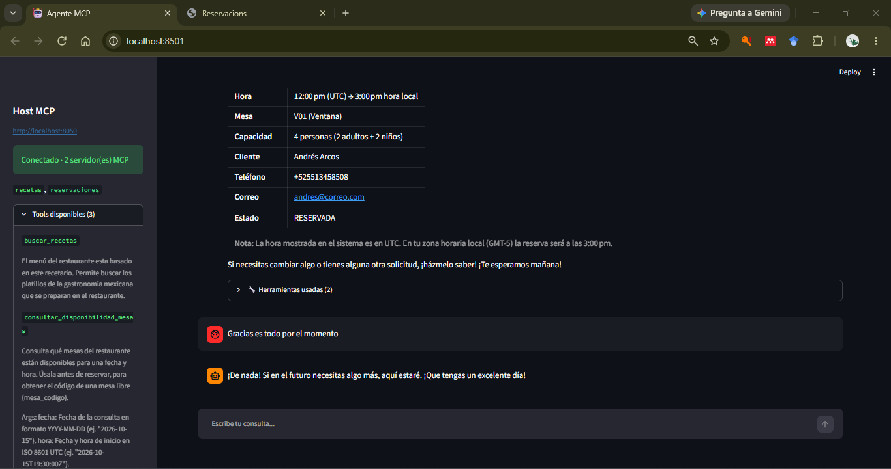
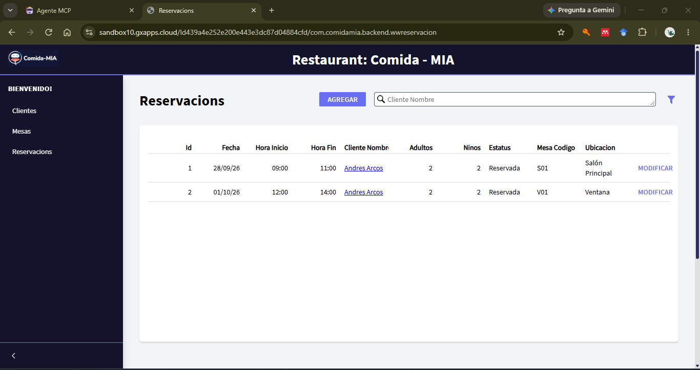
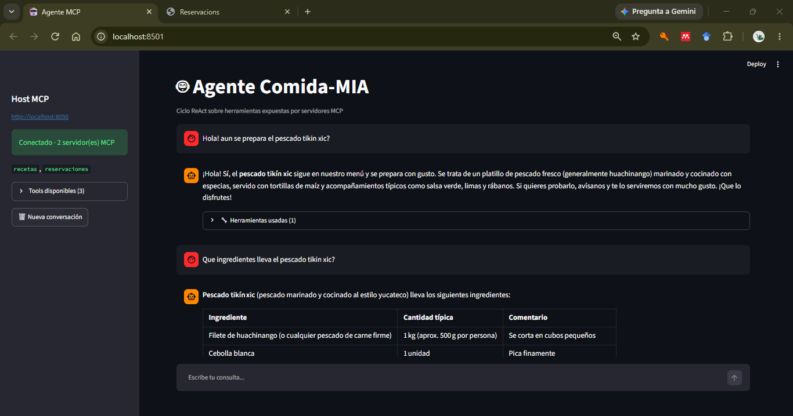

# Información sobre el proyecto
  - RAG: Se creo una base de datos vectorizada con un archivo de recetas de cocina de Gastronomía Mexicana. Una vez creada esta se carga cuando se lanza el proyecto.
  - FastAPI: Se construyo el servicio del Agente-ReAct con FastAPI en cual se encarga de cargar la base vectorizada e inicializar las tools.
  - MCP: Las tools se crearon utilizando el protocolo MCP, el cual consta de dos servidores y tres tools. El server de recetas con la base vecotizada, el cual tiene la tool buscar receta; y el server de reservación, este tiene dos tools, una para consultar las mesas disponibles y la otra para hacer una reservación.
  - APIs externas, se creo un cliente REST para consumir la API del restaurante.
  - UI: para la interacción con el agente se utilizo streamlit el cual permite intractuar con el agente.
  - LLM: como motor de razonamiento se utilizó el modelo openai/gpt-oss-20b, el cual permite manejaruna ventana de contexto de 8000 tokens por minuto sobre la PAAS de GROQ.


# Host multi-servidor MCP con ciclo ReAct

Host expuesto como API REST (FastAPI) que se conecta a **múltiples servidores MCP**
simultáneamente, combina sus herramientas en un solo catálogo, y ejecuta el ciclo
ReAct contra openai/gpt-oss-20b para responder queries de usuario.

## Estructura

```
host/
  config.py          -> lista de servidores MCP a conectar
  state.py           -> AppState: sesiones MCP + catálogo de tools (vive en app.state)
  mcp_manager.py      -> abre las sesiones MCP y llena el AppState
  main.py            -> ensambla la app FastAPI, lifespan, monta los routers
  routers/
    agent.py         -> /agent/query, /agent/tools  (ciclo ReAct combinado)
    mcp_direct.py     -> /mcp/servidores, /mcp/{servidor}/tools, ...  (sin pasar por el LLM)
servers/
  server_recetas.py      -> búsqueda semántica de recetas (Chroma)
  server_reservacion.py  -> disponibilidad y reservación de mesas (API ComidaMIA)
ui/
  app.py             -> interfaz de chat en Streamlit (cliente de la API REST)
```

## Cómo está enrutado

El estado (sesiones MCP, catálogo de tools) se guarda en `app.state.mcp` durante
el `lifespan`, y cada router lo lee vía `request.app.state.mcp` — así no hay
variables globales de módulo, y cualquier router nuevo que agregues puede
acceder al mismo estado sin importar nada de `main.py`.

Hay dos routers con propósitos distintos:

- **`agent.router`** (prefijo `/agent`): el ciclo ReAct completo — el LLM decide
  qué tool usar de entre TODOS los servidores conectados.
- **`mcp_direct.router`** (prefijo `/mcp`): acceso directo a un servidor MCP
  puntual, sin LLM de por medio — útil para probar que una tool funciona antes
  de meterla al agente, o para exponerla como API normal si no necesitas
  razonamiento del LLM en ese caso.

## Instalación

```bash
python -m venv venv
source venv/bin/activate   # Windows: venv\Scripts\activate
pip install -r requirements.txt
export GROQ_API_KEY="tu-api-key"    # Windows: set GROQ_API_KEY=...
```

## Ejecución

Corre uvicorn **desde la raíz del proyecto (08_Proyecto_Final)** (para que las rutas relativas en
`config.py` encuentren `servers/`):

```bash
uvicorn src.api.hosts.main:app --host 0.0.0.0 --port 8050 --reload
```

Al arrancar verás en consola algo como:

```
[recetas] ¡Base de datos vectorial cargada con éxito!
[MCP] Conectado a 2 servidor(es): ['recetas', 'reservaciones']
[MCP] Tools disponibles: ['buscar_recetas', 'consultar_disponibilidad_mesas', 'reservar_mesa']
```
Eso confirma que el host abrió una `ClientSession` con cada servidor y unificó
los catálogos de tools.

## Interfaz de chat (Streamlit)

`ui/app.py` es un cliente más de la API REST: no importa nada de `host/` ni habla
con los servidores MCP. Muestra la conversación, la traza de herramientas que usó
el agente en cada respuesta (con argumentos y resultado), y en la barra lateral los
servidores y tools conectados.

Con el host ya corriendo, en **otra terminal** y desde la raíz del proyecto:

```bash
streamlit run src/api/ui/app.py
```

Se abre en `http://localhost:8501`. Si el host no está en `localhost:8000`,
define `AGENT_API_URL` (por ejemplo `AGENT_API_URL=http://192.168.1.10:8000`).


Las reservaciones se pueden consultar en:
 
```
https://sandbox10.gxapps.cloud/Id439a4e252e200e443e3dc87d04884cfd/com.comidamia.backend.wwreservacion
```


## Ejecución

1. Consultamos el sitio de las reservaciones.



2. Conversación con el agente.






3. Validar que la reservacón se dió de alta


## Consultar base de vectorizada para RAG.



La respuesta trae el texto final y la traza de las tools que usó el agente:

```json
1. buscar_recetas

{
"consulta":"pescado tikín xic"
"resultados":5
}
{
  "resultados": {
    "ids": [
      [
        "id_chunk_88",
        "id_chunk_83",
        "id_chunk_29",
        "id_chunk_80",
        "id_chunk_60"
      ]
    ],
    "embeddings": null,
    "documents": [
      [
        "Al gusto\n12\n500\n2\n6 \nKg\nUd.\nUds.\nUds.\nCdta.\nCdta.\nUd.\nUds.\nMl\nUds.\nUds. \n193192\n1. Cortar en cubos pequeños el filete de huachinango y reservar.\n2. Picar finamente el ajo, la cebolla, el chile y el tomate. \n3. Sofreír la cebolla y el ajo, posteriormente agregar el jitomate, \norégano, epazote y chile serrano. Cocinar hasta que haya perdido \nhumedad. \n4. Incorporar el pescado, salpimentar y continuar cocinando hasta \nque esté bien cocido y la preparación seca.\n5. Rellenar las tortillas de maíz con la preparación anterior, doblar por \nla mitad y sujetar con un palillo.\n6. Freír hasta que queden crujientes. Retirar y secar sobre papel \nabsorbente. \n7. Servir acompañado de salsa verde, limas y rábanos.\nTips:\nTener cuidado al rellenar para evitar que el relleno salga durante la \nfritura. \nFilete de huachinango\nCebolla \nDiente de ajo\nTomate pera\nOrégano seco\nEpazote seco\nChile serrano\nSal \nPimienta \nTortillas de maíz\nAceite vegetal \nLimas\nRabanitos\nChef  Elizabeth Baliño, Estado de Michoacán\nIngredientes Procedimiento Cantidad Unidad MERLUZA CON SALSA DE 3 CHILES \n20 minutos 20 minutos\nTIEMPO DE PREPARACIÓN TIEMPO COCCIÓN UTENSILIOS PICANTERACIONES\n4 Tablas y cuchillos\nBandeja de horno\n1\n100\n50\n150\n80\n4\n4\n4\n120\n7\n1\n1\nAl gusto\nAl gusto\nAl gusto\nKg\nMl\nMl\nMl\nMl\nUds.\nUds.\nUds.\nMl\nUds.\nCda.\nCda.",
        "el zumo de lima y vinagre. Saz\nonar con sal y orégano. Reservar.\n3. Triturar el achiote con todas las especias de la marinada y el zumo de\nlos cítricos. \n4. Sazonar el pescado con sal y pimienta. Agregar la marinada y dejar\nreposar dur\nante 5 minutos.\n5. Asar en una sartén las hojas de plátano para suavizarlas. Reservar.\n6. En una bandeja de horno, colocar las hojas de plátano y poner encima\nlos filetes de lubina con la salsa de la marinada. \n7. Hornear dur\nante 15 a 20 minutos. \n8. Servir sobre una hoja de plátano y con la cebolla encurtida por encima.\nTips: \nEl tikin xic es una forma de preparación de los alimentos típicos de \nYucatán. En este caso lo aplicamos al pescado que generalmente se \ncocina a la brasa en una parrilla y si es un pescado entero mejor. Es una \nmarinada con especias y lima o naranja agria; cítricos típicos de la región \nque ahora sustituimos por naranjas y limones. \nPICANTE\nFiletes de lubina\nPasta de achiote\nCebolla \nClavos\nDientes de ajo\nPimienta gorda\nPimienta negra\nNaranja\nLimón amarillo\nSal\nCebolla morada\nChile habanero\nLima\nVinagre de manzana \nOrégano\nHoja de plátano \nIngredientes Procedimiento\nChef Elizabeth Vázquez\nCantidad Unidad LUBINA ZARANDEADA\nTIEMPO DE PREPARACIÓN TIEMPO COCCIÓN UTENSILIOSRACIONES\n4\nTablas y cuchillos\nRejilla para asar \nBatidora para triturar\nChef Eduardo García\nPICANTE\n 20 minutos 20 minutos\n1. Precalentar el horno o la parrilla.",
        "empezar a inflarse, es cuando se sacan y se corta por un lado para poder \nrellenarla.\n5. Freír ligeramente y reservar. \n6. Para servir, colocar un salbute y encima la cochinita pibil  deshebrada, \nla cebolla encurtida y el aguacate.\nTips:\nLos panuchos son junto con los salbutes los antojitos típicos de la \nPenínsula de Yucatán, se preparan con cochinita, pavo asado o recado \nnegro. La diferencia de los salbutes es que estos últimos no llevan frijoles \nrefritos. \nSegún el gusto por el picante, se puede agregar chile habanero a la \ncebolla macerada o hacer una salsa con chile habanero. \nPICANTE\n6968\nCochinita pibil\nMasa de maíz\nAceite para freír\nLima\nNaranja\nVinagre de manzana\nCebolla morada\nOrégano\nAguacate\nIngredientes Procedimiento\nChef Sara Herrera\nCantidad Unidad CHANCLAS POBLANAS\n30 minutos 20 minutos\nTIEMPO DE PREPARACIÓN TIEMPO COCCIÓN UTENSILIOSRACIONES\n4 Tablas y cuchillos\nSartén\n \n125\n200\n4\n5\n5\n400\n1\n1/4\n4\nG\nG\nUds.\nUds.\nUds.\nG\nUd.\nUd.\nUds.\n1. Limpiar los chiles y hervir junto con los tomates. Triturar la salsa. \n2. Freír chorizo y agregar la salsa colada para sofreír con la misma \ngrasa del chorizo.\n3. Cocinar por 15 minutos a fuego lento. \n4. Cortar el pan chapata.\n5. En la base del pan, poner un abanico de aguacate y encima  la carne \ndeshebrada y la lechuga cortada finamente.\n6. Bañar con la salsa ya en el plato.\nTips:",
        "hora en refrigeración.\n6. Asar ligeramente los tomates cherry en una sartén. \n7. Cortar los rabanitos y el chile serrano en rodajas finas.\n8. Ser\nvir en copas o platos hondos una por ción del  pescado\nmarinado y a continuación adicionar el jugo.\n9. Decor\nar con tomates cherry, rábanos y chile serrano. \n10. Acompañar con tostadas de maíz. \nTips:\nUtilizar un pescado de carne firme para evitar que se bata al \nmezclarlo con la salsa. \nTambién se puede acompañar con galletas saladas en lugar de \ntostadas. \nCebolla blanca\nApio\nSal\nAzúcar\nDiente de ajo\nJengibre\nRamita de cilantro\nZumo de lima\nBase leche de tigre\nSal\nPescado crudo\nZumo de tomate\nZumo de naranja \nSalsa ketchup\nFilete de corvina\nZumo de lima\nChef Elizabeth Baliño, Estado de Michoacan\nIngredientes Procedimiento Cantidad Unidad CAMARONES AL COCO\nCON SALSA DE MANGO\nTIEMPO DE PREPARACIÓN TIEMPO COCCIÓN UTENSILIOSRACIONES\n4\nTablas y cuchillos\nEspátula\nHorno\nBandeja de horno\nRallador\nPICANTE\n32\n120\n160\n160\n600\n80\n1\nUds.\nG\nMl\nMl\nG\nG\nUd.\n30 minutos 5 minutos\nCocinero Jose María Díaz, Órale Compadre\n1. Macerar los camarones en leche de coco y soja.\n2. Cor\ntar el mango en abanico y espolvorear azúcar . Hornear a\n180ºC por 15 minut os. Asar en la misma bandeja el chile\nhabaner\no. Triturar y rectificar la sazón. Reservar.\n3. Escurrir los camar\nones y rebozarlos en coco rallado.",
        "Reservar en la nevera 24 horas.  \n2. Para la cochinita pibil: cortar la carne en cubos de 8 cm aproxi-\nmadamente. \n3. Preparar el recado: en el molcajete o mortero moler las pimien-\ntas, los clavos, el orégano, la canela, el comino y la sal hasta \nobtener un polvo.\n4. Agregar los dientes de ajo y moler hasta obtener una pasta.\n5. Agregar el achiote cortado en cuadros pequeños y el vinagre. \nMoler todo hasta obtener una pasta ligeramente líquida.\n6. Poner 100 miligramos de agua en la olla de presión y encen-\ndemos el fuego.\n7. Mojar los trozos de carne en el recado rojo y colocarlos dentro de \nla olla. Cocinar por 40 minutos. \n8. Ya que la carne esté suave y un poco tibia, deshebrar con un \ntenedor. Regresar a la olla y poner al fuego para que reduzca el \ncaldo que haya quedado.\n9. Servir con tortillas y la cebolla encurtida.\nTips:\nLa cochinita pibil se cuece envuelta en hojas de plátano, que se \npueden colocar debajo y encima de la carne. \nSe puede cocinar también en el horno durante  1 hora a 180 ºC. \nColocar en un refractario y envolver con las hojas de plátano.\n \n. \nCarne de cerdo\n(cabeza de lomo y jamón)\nAchiote \nVinagre de caña\nDientes de ajo\nPimientas negras\nClavos\nCanela en polvo\nComino en semillas\nOrégano seco\nSal\nTortillas\nCebolla roja\nLimas\nChiles habaneros\n \nMolcajete / Mortero\nOlla de presión\nChef Eduardo García\nProcedimiento Ingredientes Cantidad Unidad"
      ]
    ],
    "uris": null,
    "included": [
      "metadatas",
      "documents",
      "distances"
    ],
    "data": null,
    "metadatas": [
      [
        null,
        null,
        null,
        null,
        null
      ]
    ],
    "distances": [
      [
        0.4713984727859497,
        0.4895120859146118,
        0.49138641357421875,
        0.5056663155555725,
        0.5252907276153564
      ]
    ]
  }
}
```

`/agent/query` acepta además un campo opcional `historial` (lista de turnos
previos `{"role": "user" | "assistant", "content": "..."}`) para mantener una
conversación. El historial es solo texto: el agente recuerda lo que se dijo, pero
no los resultados crudos de las tools de turnos anteriores.

FastAPI también genera documentación interactiva automática en
`http://localhost:8000/docs`, donde puedes ver y probar todas estas rutas
agrupadas por los tags `agente` y `mcp-directo`.

El modelo decidirá por sí mismo qué tools llamar (de cualquiera de los servidores),
o ninguna — eso es exactamente el ciclo ReAct funcionando con MCP.


## Notas de diseño

- Las sesiones MCP se abren **una sola vez**, al arrancar la app (`lifespan`), y
  se reutilizan para todos los requests — no se relanza el subproceso en cada query.
- `tool_to_session` mapea cada nombre de tool a la `ClientSession` que la sirve,
  para saber a cuál servidor reenviar la llamada cuando el LLM la solicita.
- Si necesitas conectar un servidor MCP remoto (HTTP/SSE) en vez de local (stdio),
  cambia `stdio_client(params)` por `sse_client(url)` de `mcp.client.sse` para
  ese servidor en particular; el resto del host no cambia.
